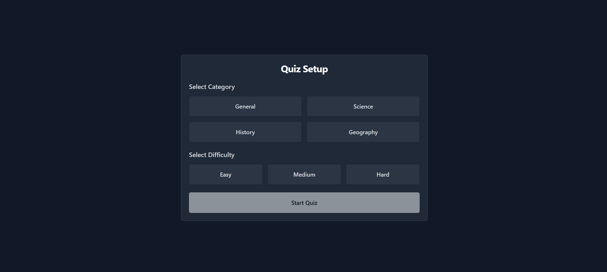
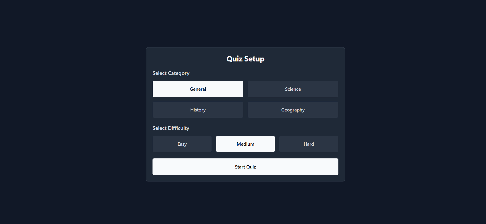
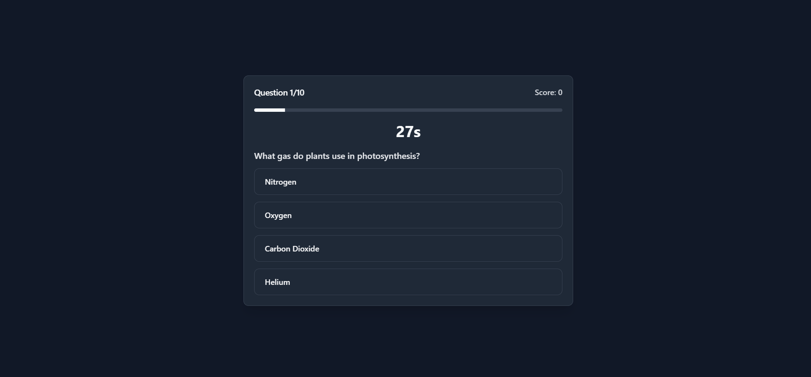
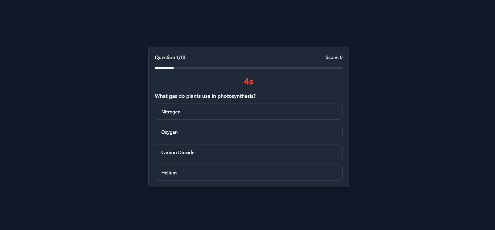
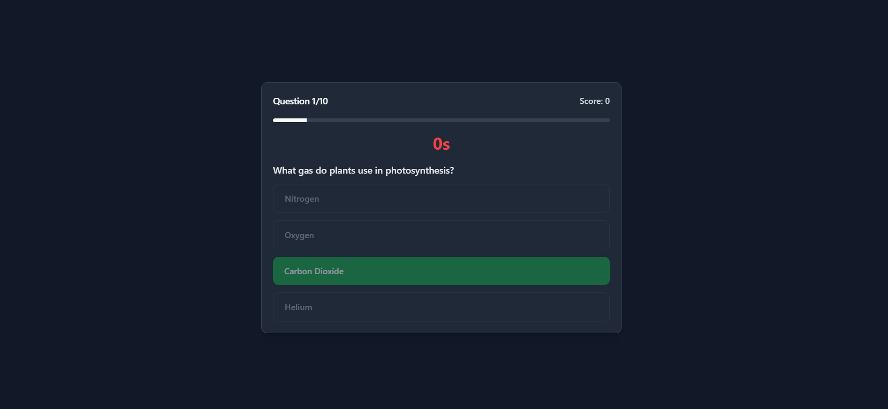
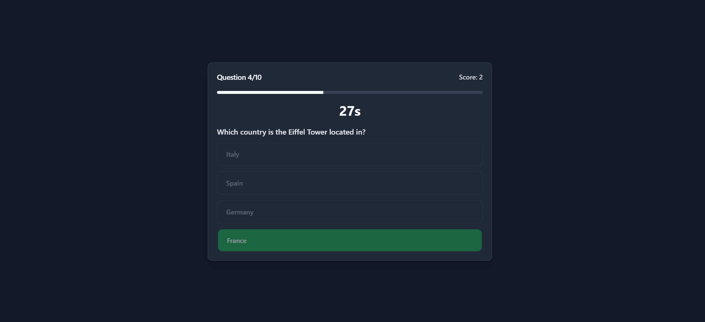
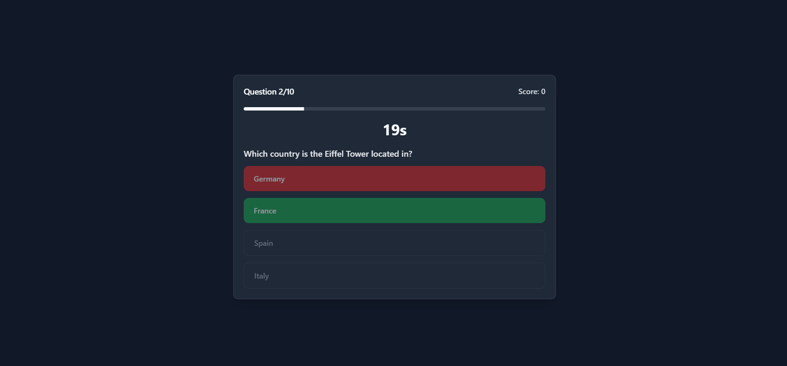

# Interactive Quiz Game 🎯

A shitty quiz game built with React, TypeScript, and Tailwind CSS. Features multiple categories, difficulty levels, and ofc dark theme (Because who the actual fuck uses light theme)

Keep in mind that this is a shitty quiz game, and the questions are not very good, and the code is probably not very good either. But it works, and that's all that matters.

Also, I did not make an API for this, and it is not recommended to use this in a production environment due to the fact it's easily exploitable.

If you want to make an API just simply edit the quizController.ts file and add an API there and edit the components to handle loadings and errors.

Also, Note that I am not a professional React developer, I am mainly a Backend Developer using Rust, TS and Python on basically all my projects, which is why certain snippits of the code is "borrowed" from the internet and chatgpt. Other than those snippits, everything is made by me.

## 📸 Screenshots

<div align="center">
  <details open>
    <summary><strong>Setup & Categories</strong></summary>
    <br/>
    
    <p><em>Quiz Setup - Select your category and difficulty</em></p>
    <br/>
    
    <p><em>Category and Difficulty Selection</em></p>
  </details>

  <details open>
    <summary><strong>Quiz Interface</strong></summary>
    <br/>
    
    <p><em>Quiz Interface - Answer questions with timer</em></p>
    <br/>
    
    <p><em>Timer Warning - When time is running low</em></p>
    <br/>
    
    <p><em>Time's Up - When the timer reaches zero</em></p>
  </details>

  <details open>
    <summary><strong>Answer Feedback</strong></summary>
    <br/>
    
    <p><em>Correct Answer Feedback</em></p>
    <br/>
    
    <p><em>Wrong Answer Feedback</em></p>
  </details>

  <details open>
    <summary><strong>Results</strong></summary>
    <br/>
    
    <p><em>Results Screen - View your final score</em></p>
  </details>
</div>

## 🌟 Features

- 🎨 Modern, responsive design with dark mode
- 📱 Mobile-first and touch-friendly interface
- 🎯 Multiple quiz categories:
  - General Knowledge
  - Science
  - History
  - Geography
- 🎚️ Three difficulty levels:
  - Easy
  - Medium
  - Hard
- ⏱️ Timer-based challenges
- 🎯 Score tracking and progress indicators
- ✨ Smooth animations and transitions
- 🌐 Cross-browser compatibility

## 🛠️ Built With

- [React](https://reactjs.org/) - UI Library
- [TypeScript](https://www.typescriptlang.org/) - Programming Language
- [Vite](https://vitejs.dev/) - Build Tool
- [Tailwind CSS](https://tailwindcss.com/) - CSS Framework
- [shadcn/ui](https://ui.shadcn.com/) - UI Components
- [Framer Motion](https://www.framer.com/motion/) - Animation Library
- [React Router](https://reactrouter.com/) - Routing
- [Radix UI](https://www.radix-ui.com/) - Headless UI Components
- [Lucide Icons](https://lucide.dev/) - Icons

## 🚀 Getting Started

### Prerequisites

- Node.js (v16 or higher)
- pnpm (v8 or higher)

### Installation

1. Clone the repository
   ```bash
   git clone https://github.com/yourusername/interactive-quiz-game.git
   cd interactive-quiz-game
   ```

2. Install dependencies
   ```bash
   pnpm install
   ```

3. Start the development server
   ```bash
   pnpm dev
   ```

4. Build for production
   ```bash
   pnpm build
   ```

## 🔧 Configuration

No need for any Configuration

## 🏗️ Project Structure

```
src/
├── components/          # React components
│   ├── Quiz.tsx        # Main quiz interface
│   ├── QuizSetup.tsx   # Category/difficulty selection
│   └── Results.tsx     # Quiz results display
├── context/
│   └── QuizContext.tsx # Global state management
├── types/
│   └── quiz.ts         # TypeScript interfaces & enums
└── controllers/
    └── quizController.ts # Quiz logic & question management
```

## 💡 Key Features Implementation

### State Management
The shitty quiz uses React Context (QuizContext) for global state management. and the state is defined as:

```typescript
{
  currentQuestion: number;
  score: number;
  questions: Question[];
  selectedCategory: QuizCategory;
  selectedDifficulty: QuizDifficulty;
  timeRemaining: number;
  isQuizComplete: boolean;
}
```

### Quiz Flow
1. User selects category and difficulty (QuizSetup.tsx)
2. Questions are loaded from quizController.ts
3. Timer starts for each question (Quiz.tsx)
4. Answers are validated and scored
5. Results displayed after completion (Results.tsx)

## 🤝 Contributing

1. Fork the repository
2. Create your feature branch (`git checkout -b feature/AmazingFeature`)
3. Commit your changes (`git commit -m 'Add some AmazingFeature'`)
4. Push to the branch (`git push origin feature/AmazingFeature`)
5. Open a Pull Request

## 📄 License

This project is licensed under the MIT License - see the [LICENSE](LICENSE) file for details.

## 👏 Acknowledgments

- Thanks to [ChatGPT](https://chatgpt.com/) for helping me with the quiz questions and answers, and basically most of the code questions I did not have an answer for, and for this README
- Sick fucking icons provided by [Lucide Icons](https://lucide.dev/) (I mainly use these and react-icons but that's it, so shout out to them)
- The UI components provided by [shadcn/ui](https://ui.shadcn.com/) (Shout out to them for making wonderful components and a great documentation)
